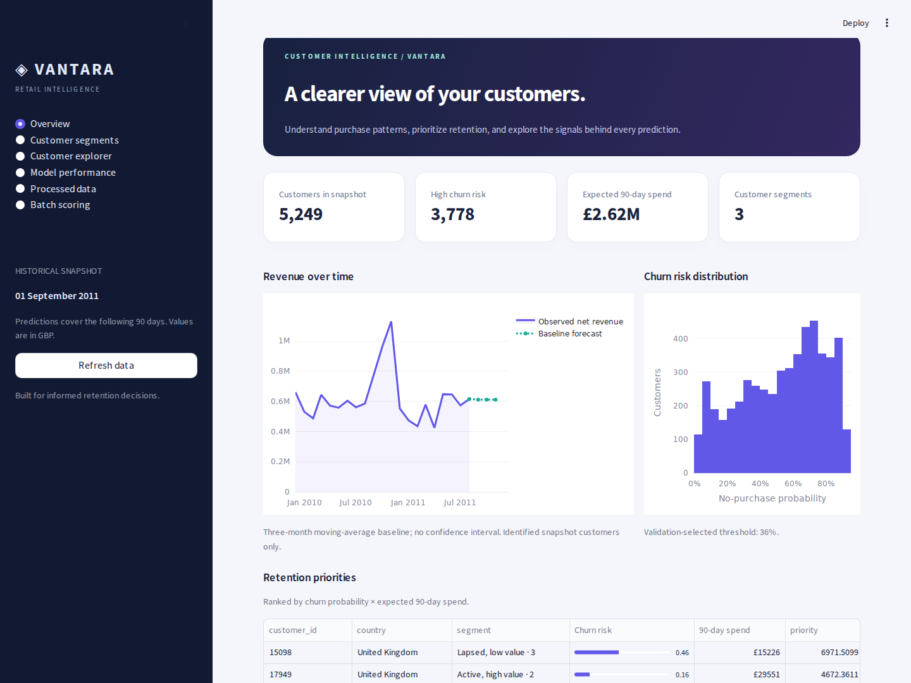

# Vantara Customer Intelligence

A complete **Python 3.11** customer analytics project using both supplied Online Retail II sheets. The Streamlit dashboard consumes a FastAPI backend. PostgreSQL is configured for Docker; SQLite makes the native Windows demo easy to run.



## Run on Windows

Extract the ZIP. Open a CMD terminal in `customer-behavior-prediction`. The dataset, trained models and processed data are included: **retraining is not required to open the dashboard**.

```bat
py -3.11 --version
py -3.11 -m venv .venv
.venv\Scripts\activate
python -m pip install --upgrade pip
python -m pip install -r requirements-lock.txt
```

Open two terminals, activating the same environment in each:

```bat
:: Terminal 1
.venv\Scripts\activate
python -m uvicorn api.main:app --host 127.0.0.1 --port 8000
```

```bat
:: Terminal 2
.venv\Scripts\activate
python -m streamlit run frontend/dashboard.py
```

Open **http://localhost:8501**. Swagger API documentation: **http://localhost:8000/docs**. Readiness: **http://localhost:8000/health**. After installation, `start_windows.bat` opens both terminals. Wait for “Application startup complete” in the API terminal, then refresh the dashboard if necessary.

Training and execution were tested using **CPython 3.11.13 on Linux x86-64, CPU**. Windows commands are provided, but a Windows host was not available to execute them. Do not switch to Python 3.12/3.13 with these serialized artifacts. Linux users can create `.venv` with `python3.11 -m venv .venv`, activate it and run `bash start.sh`. Only load trusted model artifacts.

## Dashboard update: errors and processed files

Open **Model performance**, then scroll to **Model error analysis**. It shows MAE, MSE, RMSE, R², median absolute error, signed bias, actual-versus-predicted plots, error distributions and the largest errors. Switch between spend and capped purchase timing. The **Churn mistakes** tab shows incorrect classifications, false alerts and missed churners. All these diagnostics use only the frozen 788-customer test partition. No model is retrained or selected using these charts.

MAE and RMSE use GBP (spend) or days (timing); MSE uses squared units. R² is not percentage accuracy. Error concentration is descriptive evidence, not proof of the cause of poor performance. MAPE is deliberately omitted for spend because many true outcomes are zero.

Open **Processed data** for a 100-row preview and full CSV downloads:

| File relative to the project folder | Contents |
|---|---|
| `data/processed/customers.parquet` | Canonical feature-engineered table: 5,249 customers, inputs and future target labels |
| `data/processed/customer_features.csv` | Excel-readable copy: customer ID + 23 predictor columns; no targets |
| `data/processed/customers_with_targets.csv` | Full modeling table, including target labels |
| `data/processed/scored_customers.parquet` | Features, targets, predictions and split membership |
| `data/processed/sequences.npz` | Padded purchase sequences for the LSTM |
| `data/interim/transactions.parquet` | Cleaned transaction-level ledger |

Use **Features only** for predictors; customer ID is an identifier. Future labels, predictions and partition names must not be used as training features. The processed downloads are full snapshots; batch scoring still accepts at most 5,000 rows per upload.

To regenerate just the two CSV files without training:

```powershell
python -m scripts.export_processed
```

To read the original Parquet table:

```python
import pandas as pd
df = pd.read_parquet("data/processed/customers.parquet")
print(df.shape)
print(df.head())
```

The API checks the canonical feature hash, split coverage and saved test metrics before returning diagnostics. A stale/mismatched snapshot returns HTTP 409 rather than silently reporting misleading results. Restart both services after applying this update; use **Refresh data** to clear cached responses. This update adds no dependencies.

## Actual results and important limitations

Production models were selected using validation performance before test evaluation. The held-out partition contains 788 customers.

| Deployed measure | Test result | Requirement |
|---|---:|---|
| Random Forest churn ROC-AUC | 0.8168 | >=0.80: met |
| Churn recall | 0.8960 | >=0.70: met |
| Churn precision | 0.7105 | Reported |
| Churn F1 | 0.7926 | Reported |
| Churn accuracy | 0.7310 | Reported |
| Random Forest value R² | 0.4820 | >=0.60: **not met** |
| Value MAE | GBP 709.99 | Reported |
| Value RMSE | GBP 4,425.68 | Reported |
| LSTM capped-wait MAE | 20.56 days | Ridge baseline: 19.40 days |

The Ridge value comparison reaches test R² 0.6549, but its validation R² is only 0.2727. The selected Random Forest wins validation with R² 0.8481. **We do not change the selected model after inspecting test scores.** Rare large wholesale purchases make original-unit value estimates unstable. The LSTM does not beat the static timing baseline. These gaps are openly retained in the dashboard and report.

The dashboard shows the whole historical snapshot, including train/validation customers. Only the reported test partition measures held-out performance. No production-grade calibrated probability, causal retention effect or fraud-detection accuracy is claimed.

## Included components

- Six classical churn models: Logistic Regression, Decision Tree, Random Forest, XGBoost, LightGBM and KNN.
- PyTorch ANN with batch normalization/dropout/early stopping, purchase-event LSTM, spending autoencoder.
- Three value regressors, a next proxy-category classifier and a static timing baseline.
- K-Means with elbow/silhouette k selection and a Gaussian mixture comparison, with readable segment profiles.
- Global and local SHAP, three interactive force plots, LIME comparisons and partial-dependence plots.
- Six dashboard pages, filters, risk/value leaderboard, revenue and baseline forecast, CSV scoring/export and individual PDF downloads.
- Stored prediction snapshots, persisted batch history and heuristic unseen-product recommendations.
- Original workbook, cleaned/processed data, all model artifacts, notebooks, diagrams, final report, tests, screenshots and silent browser walkthrough.

## Data and targets

The original workbook contains **1,067,371** rows. Cleaning removes 34,335 exact duplicates, 6,019 zero-quantity/nonpositive-price rows and 7 domain-extreme lines, leaving 1,027,010 rows. Returns remain signed and contribute return-rate features. IQR outliers are flagged, not automatically removed, preserving legitimate bulk orders. Domain bounds are configurable (absolute quantity 50,000; unit price GBP 20,000). Extreme records are preserved separately for review.

22.77% of source rows have no Customer ID. They remain in the clean ledger but are excluded from customer modeling. There are 5,938 identified customers overall, and **5,249** eligible purchasing customers before the cutoff.

- Prediction cutoff: **2011-09-01 00:00**. Features use only earlier transactions.
- Outcome interval: **[2011-09-01, 2011-11-30)**, exactly 90 days. Data extends through 2011-12-09, so labels are complete.
- Churn: no positive purchase during the outcome interval. Actual churn prevalence is 57.31%, not a minority class.
- Predicted CLV: **90-day gross-spend proxy**, not full lifetime profit. Historical CLV is signed net spend; future refunds are not subtracted from the gross target.
- Timing: min(days to next purchase, 90). This is capped waiting time, not uncensored survival analysis.
- Categories: fixed description-rule proxies, not a real merchant taxonomy. Next category is the first future product line, using deterministic time/invoice/SKU ties, with `no_purchase` as a separate class.
- Discount sensitivity: a median-price proxy, not an observed campaign-response variable.
- Exact identical repeated invoice lines cannot be distinguished from accidental duplicates; this limitation is documented.

See `docs/feature_dictionary.md`, `data_audit.json`, and `vif.csv`. The actual source period does not span a leap year, despite that claim in the PRD. Timestamp arithmetic handles the observed dates directly.

## Evaluation discipline

One row per customer, stratified 70/15/15 train/validation/test split (3,674 / 787 / 788), seed 42. Five-fold CV runs inside the training split. Preprocessing is fitted within each fold. Random Forest/XGBoost use training-only grid search; XGBoost stopping and operating thresholds use validation. Neural CV uses an additional internal stopping split distinct from the scored fold.

Final test evaluation occurs after selection. The reproducibility test reruns the frozen configuration in an isolated directory; it does not tune to test results. Regression comparisons use the same churn-stratified folds. The autoencoder is unsupervised: a 95th-percentile validation reconstruction-error threshold flags review cases without pretending there are fraud labels.

This follows the PRD's random customer split; **it is not a forward-time backtest**. Shared pre-cutoff catalog statistics are assumed known operationally. Seasonal drift and new-customer performance need future temporal validation. Recommendations are heuristic and ranking quality is not measured. The revenue overlay is explicitly a three-month moving average, not a validated demand model.

## Rebuild the project

```bash
python run_pipeline.py
# Reuse prepared feature/sequence files:
python run_pipeline.py --skip-prepare
```

All production stages are scripted; notebooks are optional exploration. The pipeline prepares data, trains/evaluates every required model, creates explanations/diagrams/EDA assets and writes the final report. Allow several minutes on a CPU.

Settings live in `config/config.yaml`: source file, cutoffs, seed, validation limits, split/CV settings, search grids, estimator parameters and neural training controls. Architecture and deterministic feature formulas are versioned in code. Environment overrides: `CONFIG_PATH`, `MODEL_ARTIFACT_PATH`, `DATABASE_URL`, `API_BASE_URL`, `LOG_LEVEL`.

After intentional retraining, stop the API and run:

```bash
python -m scripts.refresh_database
```

This explicitly replaces customer/prediction/segment/invoice snapshots and preserves uploaded batch history. Restart the API afterward. Ordinary startup is idempotent and does not silently replace an existing database.

## PostgreSQL with Docker

```bat
copy .env.example .env
:: Set a local POSTGRES_PASSWORD in .env
 docker compose up --build
```

Linux equivalent: `cp .env.example .env`. Legacy `docker-compose up --build` is also supported. Compose starts PostgreSQL 16 plus the Python 3.11 API and Streamlit, with health checks and a persistent volume. Database access remains internal; ports 8000/8501 serve the app.

**Verification boundary:** Docker was unavailable and local PostgreSQL initialization was blocked in this execution environment. Configuration and the SQLAlchemy PostgreSQL schema are included, but a clean-machine Compose run is **not certified**. Actual integration/persistence tests used SQLite through the same schema. `.env` is excluded from version control. Native runs do not automatically load it; set `DATABASE_URL` in the terminal to use an external PostgreSQL database.

## API endpoints

| Method | Route | Use |
|---|---|---|
| GET | `/health` | Real database connectivity and model readiness |
| GET | `/metadata` | Model configuration, CV/test results and provenance |
| GET | `/evaluation/errors` | Verified held-out regression errors and churn mistake counts |
| GET | `/datasets/processed` | Feature preview, schema and provenance |
| GET | `/datasets/processed/download?kind=features` | Full CSV; kind is features, modeling or scored |
| GET | `/customers` | Stored scores; country/segment/value_tier filters |
| POST | `/predict` | Saved score, JSON `{"customer_id":"12347"}` |
| GET | `/customers/{id}` | Individual snapshot |
| GET | `/customers/{id}/explain` | SHAP/LIME and plain-language explanation |
| POST | `/predict/batch` | Multipart CSV, up to 5 MB and 5,000 rows |
| GET | `/global-importance` | Mean absolute SHAP |
| GET | `/trends` | Historical revenue and labeled baseline forecast |
| GET | `/recommendations/{id}` | Heuristic unseen-product suggestions |
| GET | `/report/{id}` | Customer PDF download |

An ID-only CSV retrieves existing snapshots; a feature CSV performs new tabular inference and saves the batch. Templates are under `data/examples/`. Feature scoring returns churn, purchase probability, value, next category and segment. LSTM/anomaly results are precomputed for snapshot customers; tabular uploads cannot reconstruct purchase sequences.

Latest dashboard additions and update instructions: `docs/dashboard_update.md`. Baseline report/QA results remain historical; `docs/update_test_results.txt` and `docs/update_coverage.json` record this update.

## Tests and quality

```bash
python -m pytest --cov=src --cov-report=term-missing --cov-report=html -q
python -m ruff check src api frontend tests scripts run_pipeline.py
```

The suite includes a full real-data retraining test and can take several minutes. `pytest -m "not slow" -q` is a fast subset, not the full coverage gate. Assertions cover returns/RFM arithmetic, future-data mutations, cutoff boundaries, customer disjointness, padded sequences, invalid inputs, model-artifact consistency, explanations and database persistence.

Optional live browser QA:

```bash
python -m pip install -r requirements-browser.txt
python -m playwright install chromium
python -m scripts.check_live
```

This starts both services, runs six Streamlit page tests plus the diagnostics interaction test over real HTTP, walks through all pages, uploads a CSV, downloads its scores and a customer PDF, captures screenshots/video, and benchmarks 100 warm saved-score requests. `docs/performance.json` records measured timing. This is local SQLite behavior, not a PostgreSQL/concurrent-load SLA. Initial load may exceed the 3-second target; warm segment navigation is measured separately.

## Files and documentation

`src/data`, `src/features`, `src/models`, `src/segmentation`, `src/explainability` contain reusable pipeline code. `api` serves it and `frontend/dashboard.py` is an HTTP-only client. `models_artifacts` contains trained models, transforms and full metadata. `docs/final_report.pdf` includes comparisons, limitations and a three-page mathematical appendix. The three notebooks cover EDA, feature engineering and saved model experiments.

The PRD directory structure is preserved. Extra `scripts/`, `data/examples/` and browser requirements support handover. Routes are kept in `api/main.py` for this compact prototype; `api/routers/` is reserved. The supplied workbook replaces generic references to raw CSV in the PRD.

Authentication, role-based access, streaming, A/B tests, production CI/CD and Transformers remain deferred as specified. The optional unrelated Kaggle demographics dataset and CatBoost are omitted. Use a new untouched time period for future value-model changes, probability calibration and temporal backtests.

## Attribution

Chen, D. (2012). *Online Retail II* [Dataset]. UCI Machine Learning Repository. https://archive.ics.uci.edu/dataset/502/online+retail+ii. DOI https://doi.org/10.24432/C5CG6D. Dataset license: CC BY 4.0. The included source is the supplied workbook. Requirements: supplied Vantara product requirements document v1.0.

Implementation guidance: scikit-learn, Common pitfalls and recommended practices, https://scikit-learn.org/stable/common_pitfalls.html. Exact package versions are pinned in `requirements-lock.txt`; the `nvidia-nccl` Linux-only dependency has a platform marker. Optional browser packages are separate.
